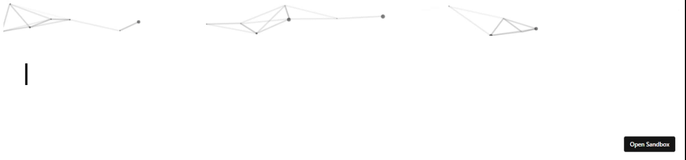

 Welcome to my Github Repo 😀 

<!--
**Raymo111/Raymo111** is a ✨ _special_ ✨ repository because its `README.md` (this file) appears on your GitHub profile.

Here are some ideas to get you started:

- 🔭 I’m currently working on ...
- 🌱 I’m currently learning ...
- 👯 I’m looking to collaborate on ...
- 🤔 I’m looking for help with ...
- 💬 Ask me about ...
- 📫 How to reach me: ...
- 😄 Pronouns: ...
- ⚡ Fun fact: ...
-->
<!--
<table>
	<tr>
	</tr>
	<tr>
		<th>
			<h2><code>𝚂𝚙𝚎𝚌𝚒𝚊𝚕</code>: 𝙸'𝚖 𝚙𝚊𝚛𝚝𝚒𝚌𝚒𝚙𝚊𝚝𝚒𝚗𝚐 𝚒𝚗 𝙷𝚊𝚌𝚔𝚝𝚘𝚋𝚎𝚛𝚏𝚎𝚜𝚝!</h2>
			𝙰𝚗𝚢𝚘𝚗𝚎 𝚠𝚑𝚘 𝚠𝚊𝚗𝚝𝚜 𝚝𝚘 𝚒𝚜 𝚠𝚎𝚕𝚌𝚘𝚖𝚎 𝚝𝚘 𝚙𝚊𝚛𝚝𝚒𝚌𝚒𝚙𝚊𝚝𝚎! 𝙹𝚞𝚜𝚝 𝚜𝚒𝚐𝚗 𝚞𝚙 𝚊𝚝 <a href="https://hacktoberfest.digitalocean.com/">𝚑𝚝𝚝𝚙𝚜://𝚑𝚊𝚌𝚔𝚝𝚘𝚋𝚎𝚛𝚏𝚎𝚜𝚝.𝚍𝚒𝚐𝚒𝚝𝚊𝚕𝚘𝚌𝚎𝚊𝚗.𝚌𝚘𝚖/</a>.
				 𝙱𝚊𝚜𝚒𝚌𝚊𝚕𝚕𝚢, 𝚖𝚊𝚔𝚎 𝟺 𝙿𝚁𝚜 𝚝𝚘 𝙶𝚒𝚝𝙷𝚞𝚋 𝚛𝚎𝚙𝚘𝚜 𝚊𝚗𝚍 𝚐𝚎𝚝 𝚝𝚑𝚎𝚖 𝚖𝚎𝚛𝚐𝚎𝚍 𝚘𝚛 𝚝𝚊𝚐𝚐𝚎𝚍 <code>hacktoberfest-accepted</code> 𝚠𝚒𝚕𝚕 𝚐𝚎𝚝 𝚌𝚘𝚘𝚕&nbsp𝚜𝚠𝚊𝚐!
		</th>
	</tr>
	<tr>
		<td>
				<b>𝙻𝚒𝚜𝚝 𝚘𝚏 𝚖𝚢 𝚛𝚎𝚙𝚘𝚜 𝚙𝚊𝚛𝚝𝚒𝚌𝚒𝚙𝚊𝚝𝚒𝚗𝚐 𝚒𝚗 𝚝𝚑𝚒𝚜 𝚊𝚠𝚎𝚜𝚘𝚖𝚎 𝚎𝚟𝚎𝚗𝚝:<b>
				<ul>
					<li><a href="https://github.com/Raymo111/emoji">𝚁𝚊𝚢𝚖𝚘𝟷𝟷𝟷/𝚎𝚖𝚘𝚓𝚒</a></li>
					<li><a href="https://github.com/Raymo111/drracket-customization">𝚁𝚊𝚢𝚖𝚘𝟷𝟷𝟷/𝚍𝚛𝚛𝚊𝚌𝚔𝚎𝚝-𝚌𝚞𝚜𝚝𝚘𝚖𝚒𝚣𝚊𝚝𝚒𝚘𝚗</a></li>
					<li><a href="https://github.com/Raymo111/i3lock-color">𝚁𝚊𝚢𝚖𝚘𝟷𝟷𝟷/𝚒𝟹𝚕𝚘𝚌𝚔-𝚌𝚘𝚕𝚘𝚛</a></li>
				</ul>
		</td>
	</tr>
</table>
-->
## 📖 𝙰𝚋𝚘𝚞𝚝 𝙼𝚎
- 👨‍💻 𝙵𝚞𝚕𝚕-𝚜𝚝𝚊𝚌𝚔 Web 𝚍𝚎𝚟𝚎𝚕𝚘𝚙𝚎𝚛
- 📱 Android Developer
- 📚 NLP Developer and Researcher
- 💼 worked at  Kreeti Technologies
- 🎓 𝚂𝚝𝚞𝚍ied B.Tech 𝙲𝚘𝚖𝚙𝚞𝚝𝚎𝚛 𝚂𝚌𝚒𝚎𝚗𝚌𝚎 𝚊𝚝 𝚝𝚑𝚎 𝚄𝚗𝚒𝚟𝚎𝚛𝚜𝚒𝚝𝚢 𝚘𝚏 Engineering & Management, Jaipur, 𝚌𝚕𝚊𝚜𝚜 𝚘𝚏 𝟸01𝟻
- 𝚋𝚝𝚠 𝙸 𝚞𝚜𝚎 Ubuntu  (also) on Windows 

## ⬆ 𝚆𝚑𝚊𝚝 𝙸'𝚖 𝚞𝚙 𝚝𝚘
- 🔨 𝙸’𝚖 𝚌𝚞𝚛𝚛𝚎𝚗𝚝𝚕𝚢 𝚠𝚘𝚛𝚔𝚒𝚗𝚐 𝚘𝚗 **Elixir** 𝚊𝚗𝚍 **Phoenix**.
- 🎯 𝙸 𝚙𝚕𝚊𝚗 𝚝𝚘 𝚠𝚘𝚛𝚔 𝚘𝚗 **ReactJS**
<!-- - 🤔 𝙻𝚒𝚜𝚝 𝚘𝚏 𝚒𝚜𝚜𝚞𝚎𝚜 𝙸 𝚗𝚎𝚎𝚍 𝚑𝚎𝚕𝚙 𝚠𝚒𝚝𝚑:
	- [𝚑𝚝𝚝𝚙𝚜://𝚐𝚒𝚝𝚑𝚞𝚋.𝚌𝚘𝚖/𝚁𝚊𝚢𝚖𝚘𝟷𝟷𝟷/𝚒𝟹𝚕𝚘𝚌𝚔-𝚌𝚘𝚕𝚘𝚛/𝚒𝚜𝚜𝚞𝚎𝚜/𝟷𝟹𝟼](https://github.com/Raymo111/i3lock-color/issues/136)
	- [𝚑𝚝𝚝𝚙𝚜://𝚐𝚒𝚝𝚑𝚞𝚋.𝚌𝚘𝚖/𝚁𝚊𝚢𝚖𝚘𝟷𝟷𝟷/𝚒𝟹𝚕𝚘𝚌𝚔-𝚌𝚘𝚕𝚘𝚛/𝚒𝚜𝚜𝚞𝚎𝚜/𝟷𝟻𝟿](https://github.com/Raymo111/i3lock-color/issues/159) -->

<!-- ## 🔔 𝙼𝚢 𝚁𝚎𝚌𝚎𝚗𝚝 𝙶𝚒𝚝𝙷𝚞𝚋 𝙰𝚌𝚝𝚒𝚟𝚒𝚝𝚢 -->
<!--START_SECTION:activity-->
<!-- 1. ❗️ Opened issue [#33](https://github.com/gentoo/guru/issues/33) in [gentoo/guru](https://github.com/gentoo/guru)
2. ❗️ Opened issue [#7793](https://github.com/nextcloud/android/issues/7793) in [nextcloud/android](https://github.com/nextcloud/android)
3. 🗣 Commented on [#3](https://github.com/Raymo111/kahoot-answer-bot/issues/3) in [Raymo111/kahoot-answer-bot](https://github.com/Raymo111/kahoot-answer-bot)
4. 🗣 Commented on [#3](https://github.com/Raymo111/kahoot-answer-bot/issues/3) in [Raymo111/kahoot-answer-bot](https://github.com/Raymo111/kahoot-answer-bot)
5. 🗣 Commented on [#172](https://github.com/Raymo111/i3lock-color/issues/172) in [Raymo111/i3lock-color](https://github.com/Raymo111/i3lock-color) -->
<!--END_SECTION:activity-->

<!-- ## 🔔 𝙼𝚢 𝙻𝚊𝚝𝚎𝚜𝚝 𝚃𝚠𝚎𝚎𝚝
 -->

## 📫 𝙷𝚘𝚠 𝚝𝚘 𝚛𝚎𝚊𝚌𝚑 𝚖𝚎:
 𝚈𝚘𝚞 𝚌𝚊𝚗 𝚛𝚎𝚊𝚌𝚑 𝚖𝚎 𝚊𝚝 𝚝𝚑𝚎 𝚎𝚖𝚊𝚒𝚕 𝚒𝚗 𝚖𝚢 𝚐𝚒𝚝𝚑𝚞𝚋 𝚙𝚛𝚘𝚏𝚒𝚕𝚎.
<!--𝙵𝚘𝚕𝚕𝚘𝚠 𝚖𝚢 𝚜𝚘𝚌𝚒𝚊𝚕𝚜!

 -->

<!--
- 𝙻𝚊𝚝𝚎𝚜𝚝 𝙸𝚗𝚜𝚝𝚊𝚐𝚛𝚊𝚖 𝚙𝚘𝚜𝚝𝚜 𝚊𝚗𝚍 𝚠𝚎𝚊𝚝𝚑𝚎𝚛 𝚏𝚛𝚘𝚖 [𝚑𝚝𝚝𝚙𝚜://𝚐𝚒𝚝𝚑𝚞𝚋.𝚌𝚘𝚖/𝚝𝚑𝚖𝚜𝚐𝚋𝚛𝚝/𝚝𝚑𝚖𝚜𝚐𝚋𝚛𝚝](https://github.com/thmsgbrt/thmsgbrt)
- 𝙰𝚕𝚕-𝚝𝚒𝚖𝚎 𝙶𝚒𝚝𝙷𝚞𝚋 𝚜𝚝𝚊𝚝𝚜 𝚏𝚛𝚘𝚖 [𝚑𝚝𝚝𝚙𝚜://𝚐𝚒𝚝𝚑𝚞𝚋.𝚌𝚘𝚖/𝚖𝚊𝚛𝚔𝚎𝚝𝚙𝚕𝚊𝚌𝚎/𝚊𝚌𝚝𝚒𝚘𝚗𝚜/𝚙𝚛𝚘𝚏𝚒𝚕𝚎-𝚛𝚎𝚊𝚍𝚖𝚎-𝚜𝚝𝚊𝚝𝚜](https://github.com/marketplace/actions/profile-readme-stats)
-->

<!--
**SPrio/sprio** is a ✨ _special_ ✨ repository because its `README.md` (this file) appears on your GitHub profile.

Here are some ideas to get you started:

- 🔭 I’m currently working on ...
- 🌱 I’m currently learning ...
- 👯 I’m looking to collaborate on ...
- 🤔 I’m looking for help with ...
- 💬 Ask me about ...
- 📫 How to reach me: ...
- 😄 Pronouns: ...
- ⚡ Fun fact: ...
-->
